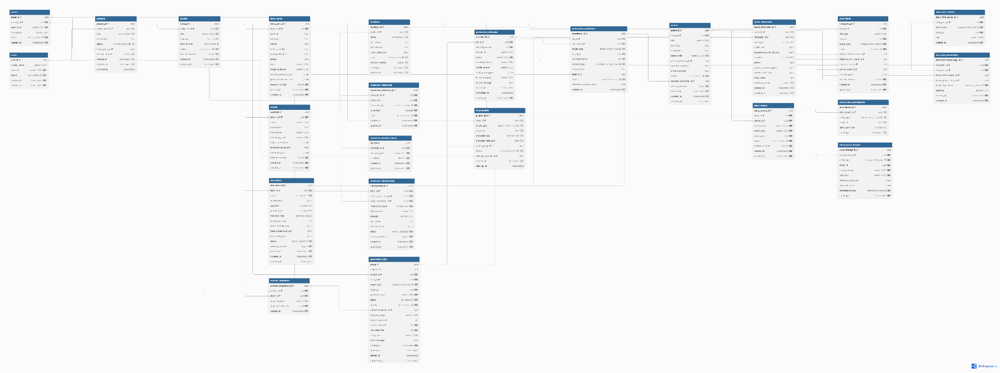

# **DATA-01 — Data Model & Persistence Specification**

**Document ID:** DATA-01  
**Document Type:** Data Model & Persistence Specification  
**Product:** OWNIVERSE  
**Project:** Character-Consistent Long-Range Story Generation  
**Primary Role:** Data Architect  
**Status:** Draft v1  
**Parent Documents:** ARCH-01, ARCH-02, DOMAIN-01, DOMAIN-02  
**Related Documents:** DATA-02, API-01, API-02, AI-01, AI-02, AI-03

## **1. Purpose**

Tài liệu này đặc tả cách các domain object của OWNIVERSE được biểu diễn và lưu trữ trong cơ sở dữ liệu quan hệ.

DOMAIN-01 đã xác định:

> Story được cấu tạo từ những đối tượng nào.

DOMAIN-02 đã xác định:

> Những đối tượng đó thay đổi theo timeline như thế nào.

DATA-01 trả lời:

> **Những dữ liệu đó sẽ được tổ chức thành các entity, quan hệ, constraint và transaction như thế nào để hệ thống có thể lưu, truy vấn và bảo vệ tính toàn vẹn dữ liệu?**

Tài liệu tập trung vào:

- relational data model;

- entity boundaries;

- relationships;

- canonical data;

- scene-character state;

- story facts;

- timeline events;

- generation metadata;

- database constraints;

- indexes;

- transaction boundaries;

- ownership;

- archive/deletion semantics;

- JSONB usage.

# **2. Persistence Goals**

Mô hình dữ liệu phải đạt các mục tiêu sau.

**DATA-G01 — Preserve Canonical Truth**

Canonical Story data phải được phân biệt với generated output.

**DATA-G02 — Preserve Referential Integrity**

Character, Scene, Story và Candidate không được tham chiếu sang Project không liên quan.

**DATA-G03 — Support Long-Range Story Queries**

Database phải có khả năng hỗ trợ truy vấn:

> Character nào xuất hiện trong Scene này?
>
> Character đang ở trạng thái gì?
>
> Event nào xảy ra trước Scene này?
>
> Character biết Fact này từ Scene nào?

**DATA-G04 — Support Generation Traceability**

Candidate phải truy ngược được về Generation Job và các dữ liệu generation liên quan.

**DATA-G05 — Avoid Over-Normalization**

Không tách mọi thuộc tính nhỏ thành một table riêng nếu không đem lại giá trị truy vấn hoặc integrity rõ ràng.

**DATA-G06 — Allow Controlled Flexibility**

Các cấu trúc sáng tạo có thể thay đổi theo Story được phép sử dụng JSONB khi phù hợp.

# **3. Primary Database**

Database chính được đề xuất cho OWNIVERSE là:

> **PostgreSQL**

Lý do chính:

PostgreSQL hỗ trợ tốt relational constraints, transaction, indexing và đồng thời có kiểu JSONB, phù hợp với domain vừa có cấu trúc rõ ràng vừa chứa creative metadata linh hoạt.

# **4. Persistence Strategy**

OWNIVERSE sử dụng mô hình:

> **Relational Core + JSONB Extensions**

Dữ liệu quan trọng cho relationship, integrity hoặc query thường xuyên được lưu relational.

Dữ liệu linh hoạt, ít cần join hoặc thay đổi cấu trúc thường xuyên có thể được lưu dưới dạng JSONB.

Ví dụ:

CharacterId

StoryId

Name

Status

nên là relational columns.

Trong khi:

PersonalityTraits

VisualPreferences

CustomMetadata

có thể phù hợp với JSONB.

# **5. JSONB Rule**

JSONB không được dùng như cách né tránh thiết kế database.

Nếu dữ liệu cần:

- foreign key;

- unique constraint;

- join thường xuyên;

- filter thường xuyên;

- referential integrity;

thì ưu tiên relational column hoặc table.

# **6. Core Persistence Hierarchy**

Cấu trúc dữ liệu cấp cao:

User

↓

Project

↓

Story

├── Story Core

├── World

├── Locations

├── Characters

├── Relationships

├── Story Facts

├── Scenes

│ └── Scene Characters

├── Story Events

└── Generation Data

Giải thích bằng lời:

Project là boundary ownership lớn nhất. Story nằm trong Project. Hầu hết dữ liệu sáng tạo đều thuộc về Story, trong khi Generation data tham chiếu các entity đó nhưng không trở thành canonical Story data.

# **7. Identity Strategy**

Core entities sử dụng:

UUID

làm primary key.

Ví dụ:

project_id UUID

story_id UUID

character_id UUID

scene_id UUID

Không dùng tên hoặc sequence hiển thị làm identity.

# **8. Why UUID**

UUID phù hợp vì:

- ID không phụ thuộc database sequence toàn cục;

- dễ tạo trong distributed environment;

- không thay đổi khi entity đổi tên;

- khó đoán hơn incremental public IDs;

- thuận lợi khi worker/service tạo resource.

# **9. Common Columns**

Các entity chính nên có các trường chung như:

id

created_at

updated_at

status

Trong đó timestamp sử dụng:

TIMESTAMPTZ

để tránh mất timezone context.

# **10. Concurrency Control**

Các canonical entity quan trọng nên có logical concurrency field:

revision_number

hoặc equivalent concurrency token.

Ví dụ:

revision_number BIGINT

Khi update:

UPDATE ...

WHERE id = @Id

AND revision_number = @ExpectedRevision

Nếu không update được row nào, hệ thống biết dữ liệu đã bị thay đổi bởi operation khác.

# **11. USER**

Logical table:

users

Trách nhiệm của bảng này là lưu identity nội bộ cần thiết cho OWNIVERSE.

Các field chính:

user_id

display_name

email

status

created_at

updated_at

Nếu authentication được quản lý bởi external identity provider, OWNIVERSE không cần lưu password trực tiếp trong domain database.

# **12. PROJECT**

Logical table:

projects

Field chính:

project_id

owner_user_id

title

description

status

cover_asset_id

created_at

updated_at

archived_at

revision_number

Quan hệ:

users 1 ───── N projects

Một user có thể có nhiều Project.

# **13. Project Ownership Constraint**

Mỗi Project phải có:

owner_user_id NOT NULL

và foreign key tới User.

Không tồn tại Project không có owner.

# **14. STORY**

Logical table:

stories

Field chính:

story_id

project_id

title

status

language

story_format

created_at

updated_at

revision_number

Trong MVP:

Project 1 ───── 1 Story

Do đó có thể áp dụng:

UNIQUE(project_id)

Sau này constraint này có thể được bỏ nếu hỗ trợ nhiều Story trong một Project.

# **15. Story Format**

story_format có thể chứa:

MANGA

COMIC

ILLUSTRATED_STORY

STORYBOARD

VISUAL_NOVEL

OTHER

Đây là metadata nghiệp vụ, không phải AI model type.

# **16. STORY CORE**

Logical table:

story_cores

Quan hệ:

stories 1 ───── 1 story_cores

Field chính:

story_core_id

story_id

premise

synopsis

theme

central_conflict

protagonist_goal

stakes

tone

target_audience

creative_direction_json

global_constraints_json

created_at

updated_at

revision_number

# **17. Story Core Hybrid Design**

Các field quan trọng như:

premise

synopsis

theme

tone

được lưu trực tiếp vì:

- UI truy cập thường xuyên;

- AI Context Builder thường sử dụng;

- dễ search;

- dễ version.

Trong khi các cấu hình linh hoạt như:

creative_direction_json

có thể chứa:

{

"visualStyle": "cinematic anime fantasy",

"pacing": "slow emotional",

"narrativeStyle": "character driven",

"colorMood": "violet blue"

}

# **18. WORLD**

Logical table:

worlds

Quan hệ MVP:

Story 1 ───── 1 World

Field chính:

world_id

story_id

name

description

time_period

technology_level

magic_system_json

social_structure_json

metadata_json

revision_number

Không phải Story nào cũng cần World phức tạp.

Row World có thể tồn tại với nhiều field rỗng.

# **19. LOCATION**

Logical table:

locations

Quan hệ:

World 1 ───── N Locations

Field chính:

location_id

world_id

name

description

environment

visual_traits_json

status

revision_number

Location là reusable entity.

Scene tham chiếu Location thay vì copy toàn bộ thông tin địa điểm.

# **20. CHARACTER**

Logical table:

characters

Đây là một trong những table quan trọng nhất của hệ thống.

Field chính:

character_id

story_id

name

aliases_json

age_text

gender_text

narrative_role

short_biography

stable_identity_json

base_appearance_json

personality_json

status

created_at

updated_at

revision_number

# **21. Character Identity**

character_id là identity kỹ thuật.

name

chỉ là display data.

Do đó:

name changed

≠

character identity changed

# **22. Stable Identity Storage**

Stable Identity có thể sử dụng JSONB vì các Character có thể có số lượng thuộc tính khác nhau.

Ví dụ:

{

"hairColor": "black",

"eyeColor": "blue",

"faceShape": "oval",

"distinctiveMarks": \[

"scar below left eye"

\]

}

Tuy nhiên các thuộc tính được hệ thống query thường xuyên trong tương lai có thể được promote thành relational columns.

# **23. Character Attribute Lock**

Không nên nhét trạng thái lock trực tiếp vào từng key một cách không có cấu trúc.

Có thể sử dụng logical table:

character_attribute_locks

Field:

lock_id

character_id

attribute_path

is_locked

created_at

updated_at

Ví dụ:

stable_identity.eyeColor

stable_identity.scar

base_appearance.hairStyle

# **24. Why Separate Locks**

Tách lock ra giúp hệ thống dễ query:

> Character này đang khóa thuộc tính nào?

và AI validation có thể kiểm tra mà không phải parse cấu trúc tùy ý quá nhiều.

# **25. CHARACTER REFERENCE**

Logical relationship:

character_references

Field:

character_reference_id

character_id

asset_id

reference_type

is_primary

status

created_at

Asset thật sẽ được mô tả chi tiết trong DATA-02.

# **26. Primary Reference Constraint**

Mỗi Character chỉ nên có tối đa một active primary reference cho cùng reference context.

Database có thể dùng partial unique index.

Ví dụ logic:

UNIQUE character_id

WHERE is_primary = true

AND status = 'ACTIVE'

Nếu sau này có temporal reference sets, DATA-02 sẽ mở rộng rule này.

# **27. CHARACTER RELATIONSHIP**

Logical table:

character_relationships

Field:

relationship_id

story_id

source_character_id

target_character_id

relationship_type

directionality

strength

description

metadata_json

status

revision_number

# **28. Relationship Direction**

Ví dụ:

A → B

trusts

không đồng nghĩa:

B → A

trusts

Do đó source và target phải được lưu riêng.

# **29. Relationship Integrity**

Cả:

source_character_id

target_character_id

phải thuộc cùng Story với relationship.

PostgreSQL foreign key thông thường không đủ để kiểm tra toàn bộ điều này nếu chỉ kiểm tra từng ID.

Application layer phải validate Story ownership trước khi insert/update.

Có thể bổ sung composite constraints ở physical design nếu cần.

# **30. STORY FACT**

Logical table:

story_facts

Field chính:

story_fact_id

story_id

fact_type

fact_text

scope_type

status

effective_from_scene_id

effective_until_scene_id

source_scene_id

source_event_id

metadata_json

created_at

updated_at

revision_number

# **31. Story Fact Scope**

Một Fact có thể thuộc:

STORY

WORLD

CHARACTER

RELATIONSHIP

LOCATION

SCENE

Thay vì tạo sáu loại Fact table khác nhau, OWNIVERSE sử dụng một Fact model chung.

# **32. Fact Entity Links**

Để liên kết Fact với các entity cụ thể, sử dụng logical table:

story_fact_entities

Field:

story_fact_entity_id

story_fact_id

entity_type

entity_id

role

Ví dụ Fact:

> A discovers B is her brother.

Có thể liên kết:

A → SUBJECT

B → RELATED_ENTITY

# **33. Polymorphic Relationship Limitation**

Vì entity_id có thể trỏ tới nhiều loại entity, relational database không thể đặt một foreign key duy nhất tới nhiều table.

Do đó integrity của story_fact_entities được kiểm tra ở:

Application Layer

và có thể bổ sung database trigger nếu implementation thực sự cần.

Không dùng trigger mặc định cho MVP để tránh complexity.

# **34. SCENE**

Logical table:

scenes

Field chính:

scene_id

story_id

title

summary

description

scene_order

primary_location_id

narrative_purpose

emotional_beat

status

selected_candidate_id

created_at

updated_at

revision_number

# **35. Scene Order Constraint**

Trong cùng một Story:

scene_order

phải xác định được thứ tự.

Không nhất thiết dùng integer liên tục.

Có thể dùng:

NUMERIC

hoặc ordering key phù hợp để dễ chèn Scene vào giữa.

# **36. Recommended Scene Ordering**

Có thể dùng:

order_index NUMERIC(12,4)

Ví dụ:

10

20

30

Nếu cần chèn giữa:

15

Sau này có thể rebalance.

Điều này đơn giản hơn việc update toàn bộ Scene mỗi khi reorder.

# **37. Scene Location**

primary_location_id có thể nullable.

Không phải mọi Scene đều cần Location entity.

Nếu Location được chỉ định, nó phải thuộc World/Story hiện tại.

# **38. SCENE CHARACTER**

Logical table:

scene_characters

Đây không chỉ là join table.

Field:

scene_character_id

scene_id

character_id

scene_role

outfit_json

appearance_override_json

emotion

action

physical_condition_json

carried_items_json

local_notes

created_at

updated_at

revision_number

# **39. Scene–Character Relationship**

Quan hệ:

Scene N ───── N Character

được triển khai thông qua:

scene_characters

Constraint:

UNIQUE(scene_id, character_id)

Một Character chỉ nên có một active SceneCharacter state cho một Scene.

# **40. Scene Character Ownership Rule**

Character và Scene phải thuộc cùng Story.

Nếu:

Scene → Story A

Character → Story B

operation phải bị reject.

# **41. Stable Identity vs Scene State**

Database cố ý tách:

characters.stable_identity_json

khỏi:

scene_characters.appearance_override_json

Điều này phản ánh domain rule:

> Scene appearance không overwrite Character identity.

# **42. Character State Persistence**

State trong Scene được chia thành hai nguồn.

Nguồn thứ nhất:

scene_characters

mô tả state trực tiếp của Scene.

Nguồn thứ hai:

story_events

\+

event_state_changes

mô tả cách state được thay đổi theo Timeline.

Hai mô hình bổ sung cho nhau.

# **43. STORY EVENT**

Logical table:

story_events

Field:

story_event_id

story_id

scene_id

event_order

event_type

description

status

created_at

updated_at

revision_number

# **44. Event Order**

Một Scene có thể chứa nhiều Events.

Do đó:

event_order

xác định thứ tự bên trong Scene.

Ví dụ:

Scene 10

Event 1

Event 2

Event 3

# **45. EVENT PARTICIPANT**

Logical table:

story_event_participants

Field:

participant_id

story_event_id

entity_type

entity_id

participant_role

Ví dụ:

A → ACTOR

B → TARGET

Sword → OBJECT

Item domain đầy đủ chưa bắt buộc trong MVP.

# **46. EVENT STATE CHANGE**

Logical table:

event_state_changes

Field:

state_change_id

story_event_id

entity_type

entity_id

state_category

state_key

previous_value_json

new_value_json

persistence_type

# **47. State Change Example**

Event:

A loses the sword

State change:

entity_type = CHARACTER

entity_id = Character A

state_category = INVENTORY

state_key = sword_ownership

previous_value = true

new_value = false

persistence_type = PERSISTENT

# **48. Persistence Type**

Possible values:

PERSISTENT

TEMPORARY

SCENE_ONLY

DERIVED

Nhờ vậy application biết State nào cần propagate.

# **49. Why Event State Changes Are Structured**

Nếu chỉ lưu:

"A loses the sword"

thì machine không biết field nào thay đổi.

event_state_changes tạo bridge giữa:

narrative event

và:

machine-readable state

Điều này quan trọng cho long-range consistency.

# **50. Character Knowledge**

Knowledge State được biểu diễn riêng vì đây là một trong những dữ liệu quan trọng nhất đối với storytelling dài.

Logical table:

character_knowledge

Field:

character_knowledge_id

character_id

story_fact_id

known_from_scene_id

known_until_scene_id

knowledge_status

confidence_or_certainty

created_at

updated_at

# **51. Knowledge Example**

Canon Fact:

B is the masked knight.

Character A:

known_from_scene_id = Scene 10

Generation Scene 5:

A does not know.

Generation Scene 15:

A knows.

# **52. Knowledge Integrity**

Character và Story Fact phải thuộc cùng Story.

Application phải enforce rule này.

# **53. Current State vs Historical State**

DATA-01 không yêu cầu tạo một table snapshot cho mọi Scene ngay lập tức.

Current canonical data có thể được lưu ở core tables.

Historical state được xác định qua:

Story Events

\+

State Changes

\+

Scene-specific State

Version snapshots cụ thể sẽ được định nghĩa trong DATA-02.

# **54. STATE QUERY MODEL**

Ở mức logical, hệ thống phải có khả năng giải quyết:

CharacterStateAt(characterId, sceneId)

bằng cách kết hợp:

Canonical Character

\+

Events before Scene

\+

Scene-specific Overrides

Implementation có thể dùng caching hoặc precomputed snapshot sau này.

# **55. GENERATION JOB**

Logical table:

generation_jobs

Field chính:

job_id

request_id

project_id

story_id

target_type

target_id

operation_type

status

priority

context_snapshot_id

progress_stage

progress_percent

current_attempt

max_attempts

created_at

queued_at

started_at

completed_at

error_code

error_message

Context Snapshot được định nghĩa sâu hơn trong DATA-02.

# **56. Job Target**

Job có thể target:

STORY

CHARACTER

SCENE

ASSET

Ví dụ image generation thông thường:

target_type = SCENE

target_id = Scene 12

# **57. GENERATION ATTEMPT**

Logical table:

generation_attempts

Field:

attempt_id

job_id

attempt_number

worker_id

status

model_identifier

model_version

configuration_json

started_at

completed_at

failure_category

failure_message

Quan hệ:

GenerationJob 1 ───── N GenerationAttempt

# **58. Attempt Constraint**

Trong một Job:

UNIQUE(job_id, attempt_number)

# **59. CANDIDATE**

Logical table:

generation_candidates

Field:

candidate_id

job_id

attempt_id

target_type

target_id

candidate_index

content_type

text_content

asset_id

status

validation_summary_json

created_at

# **60. Candidate Content**

Candidate có thể là:

TEXT

IMAGE

STRUCTURED_DATA

Nếu TEXT:

text_content

được sử dụng.

Nếu IMAGE:

asset_id

được sử dụng.

# **61. Candidate Immutability**

Candidate đã được tạo xong không nên bị overwrite.

Nếu regenerate:

new Job / Attempt

→ new Candidate

Candidate cũ vẫn tồn tại.

# **62. Selected Candidate**

Scene có:

selected_candidate_id

Nhưng candidate phải target Scene đó.

Không được chọn Candidate của Scene khác.

Application layer phải validate trước khi update.

# **63. Candidate Selection Transaction**

Flow:

Validate Candidate

↓

Validate Candidate belongs to Scene

↓

Update scenes.selected_candidate_id

↓

Commit

Operation này nên nằm trong một transaction ngắn.

# **64. AI PROPOSAL**

AI Proposal khác Candidate.

Logical table:

ai_proposals

Field:

proposal_id

story_id

target_type

target_id

proposal_type

proposed_data_json

source_job_id

status

created_at

resolved_at

resolved_by_user_id

# **65. Proposal vs Candidate**

Candidate là generated output.

Ví dụ:

an image

a scene text

Proposal là suggestion nhằm thay đổi canonical domain.

Ví dụ:

"Make Character A's goal finding her brother."

Proposal được accept/reject.

# **66. Proposal Acceptance**

Khi proposal được ACCEPTED:

không sửa trực tiếp proposal row thành canonical data.

Application tạo command cập nhật canonical entity.

Sau đó Proposal chỉ lưu:

status = ACCEPTED

như provenance.

# **67. ASSET REFERENCE**

DATA-01 chỉ cần biết Asset tồn tại dưới dạng:

asset_id

và metadata reference.

Chi tiết:

- storage provider;

- object key;

- checksum;

- variants;

- thumbnail;

- retention;

thuộc DATA-02.

# **68. Data Model Overview**

Mô hình quan hệ chính:

USER

│

└── PROJECT

│

└── STORY

│

├── STORY_CORE

│

├── WORLD

│ └── LOCATION

│

├── CHARACTER

│ ├── CHARACTER_REFERENCE

│ └── CHARACTER_ATTRIBUTE_LOCK

│

├── CHARACTER_RELATIONSHIP

│

├── STORY_FACT

│ └── CHARACTER_KNOWLEDGE

│

├── SCENE

│ ├── SCENE_CHARACTER

│ └── STORY_EVENT

│ └── EVENT_STATE_CHANGE

│

└── GENERATION_JOB

└── ATTEMPT

└── CANDIDATE

Giải thích bằng lời:

Story là trung tâm của dữ liệu nghiệp vụ. Story Core chứa nền tảng của câu chuyện. Character và Scene tồn tại độc lập nhưng được nối qua SceneCharacter. Story Event mô tả những thay đổi xảy ra theo Timeline. Generation nằm ngoài canonical Story state và chỉ tham chiếu trở lại các domain object.

# **69. Canonical Data Boundary**

Các table như:

story_cores

worlds

locations

characters

character_relationships

story_facts

scenes

scene_characters

được xem là canonical domain storage.

Các table như:

generation_jobs

generation_attempts

generation_candidates

ai_proposals

là AI/runtime-generated storage.

Hai nhóm không được nhập nhằng.

# **70. Generated-to-Canonical Rule**

Không có foreign key hoặc trigger kiểu:

Candidate created

→ automatically update Character

Canonical mutation phải đi qua Application Layer.

# **71. Status Strategy**

Không nên hard-delete ngay các core domain records đã có history.

Các entity có thể sử dụng status:

ACTIVE

ARCHIVED

và các status nghiệp vụ cụ thể khác.

# **72. Soft Delete vs Archive**

OWNIVERSE ưu tiên:

ARCHIVE

hơn is_deleted cho core creative entities.

Lý do:

Archive có ý nghĩa nghiệp vụ rõ ràng:

> entity không còn active trong Story nhưng vẫn thuộc lịch sử Project.

# **73. Hard Delete**

Hard delete chỉ phù hợp khi:

- entity mới tạo;

- chưa được entity khác tham chiếu;

- chưa được AI generation sử dụng;

- chưa trở thành phần history.

Nếu đã có provenance:

không nên hard-delete mặc định.

# **74. Foreign Key Delete Policy**

Với dữ liệu quan trọng:

ON DELETE CASCADE

không nên được dùng bừa bãi.

Ví dụ không nên:

delete Character

→ delete every Candidate automatically

History phải được bảo toàn.

# **75. Recommended Delete Behavior**

Parent entity quan trọng thường sử dụng:

RESTRICT

hoặc archive workflow.

Cascade chỉ nên dùng cho dữ liệu phụ không có giá trị lịch sử độc lập.

Ví dụ:

Character

→ temporary attribute configuration

có thể phù hợp hơn.

# **76. Data Ownership**

Mọi dữ liệu quan trọng phải truy ngược được:

Entity

↓

Story

↓

Project

↓

Owner

Ví dụ:

Candidate

→ Job

→ Story

→ Project

→ User

# **77. Cross-Project Protection**

Application phải kiểm tra ownership ở mọi mutation.

Không được tin:

characterId

do client gửi chỉ vì ID tồn tại.

Phải xác nhận:

Character belongs to user's Project

# **78. Indexing Strategy**

Mỗi foreign key được query thường xuyên nên có index.

Ví dụ:

stories.project_id

characters.story_id

scenes.story_id

scene_characters.scene_id

scene_characters.character_id

story_events.scene_id

generation_jobs.story_id

generation_jobs.status

generation_attempts.job_id

generation_candidates.job_id

# **79. Scene Index**

Một index quan trọng:

(story_id, scene_order)

vì việc load Story Timeline sẽ sử dụng thường xuyên.

# **80. Scene Character Index**

Recommended:

UNIQUE(scene_id, character_id)

và:

INDEX(character_id)

để query:

> Character xuất hiện ở những Scene nào?

# **81. Generation Job Index**

Worker/runtime thường query:

status

priority

created_at

Do đó có thể cần:

INDEX(status, priority, created_at)

Exact indexing sẽ được benchmark khi implementation.

# **82. JSONB Indexing**

Không tạo GIN index cho mọi JSONB column mặc định.

Chỉ tạo khi application thực sự query JSON keys thường xuyên.

Ví dụ nếu thường xuyên filter:

stable_identity_json -\> eyeColor

mới cân nhắc index.

# **83. Full-Text Search**

Trong tương lai có thể sử dụng PostgreSQL full-text search cho:

- Story title;

- Character;

- Scene text;

- Story Facts.

Không phải requirement bắt buộc cho MVP.

# **84. Transaction: Create Character**

Flow:

BEGIN

Create Character

Create Initial Locks if supplied

Attach existing references if valid

COMMIT

Nếu một bước quan trọng fail:

rollback toàn bộ.

# **85. Transaction: Create Scene**

BEGIN

Create Scene

Insert SceneCharacters

Validate Character ownership

Insert initial scene metadata

COMMIT

Không nên tạo Scene thành công nếu SceneCharacters chứa Character từ Story khác.

# **86. Transaction: Canonical Character Update**

BEGIN

Validate Expected Revision

Update Character

Increment Revision

Write change metadata/version reference

COMMIT

Version persistence chi tiết được DATA-02 định nghĩa.

# **87. Transaction: Select Candidate**

BEGIN

Load Scene

Load Candidate

Validate:

Candidate target == Scene

Candidate status is selectable

Update selected_candidate_id

COMMIT

# **88. AI Generation Transaction Rule**

Không mở transaction database trong lúc AI inference chạy.

Sai:

BEGIN

Call AI for 90 seconds

Save Candidate

COMMIT

Đúng:

Read Snapshot

↓

AI Runtime

↓

BEGIN

Persist Result

Update Job

COMMIT

# **89. Job Completion Transaction**

Khi result hoàn thành:

BEGIN

Create / Confirm Candidate

Update Attempt

Update Job = COMPLETED

COMMIT

Asset persistence phải đã đạt trạng thái hợp lệ trước khi Candidate image được xem là complete.

DATA-02 sẽ mô tả chi tiết hơn.

# **90. Data Validation Layers**

Validation tồn tại ở cả:

Application Layer

và:

Database Layer

Database đảm bảo những invariant có thể biểu diễn bằng:

- NOT NULL;

- FK;

- UNIQUE;

- CHECK.

Application đảm bảo những business rule phức tạp như:

> Character và Scene phải cùng Story.

# **91. CHECK Constraints**

Ví dụ:

progress_percent BETWEEN 0 AND 100

hoặc:

source_character_id \<\> target_character_id

nếu self-relationship không được cho phép.

Tuy nhiên nếu Story cần relationship với bản thân trong một use case đặc biệt, rule có thể được nới.

# **92. Enum Persistence**

Không nhất thiết dùng PostgreSQL native ENUM cho mọi status.

Khuyến nghị MVP:

VARCHAR / TEXT

\+

Application Enum

\+

CHECK Constraint when stable

Lý do:

native ENUM migration phức tạp hơn nếu trạng thái thay đổi thường xuyên.

# **93. Nullability**

NULL phải có ý nghĩa rõ ràng.

Ví dụ:

primary_location_id = NULL

có nghĩa:

> Scene chưa xác định Location.

Không dùng:

00000000-0000...

để biểu diễn missing entity.

# **94. Empty String Rule**

Text field optional nên thống nhất:

NULL

hoặc empty string.

Khuyến nghị:

optional missing value → NULL.

Không lưu lẫn cả hai kiểu nếu có thể tránh.

# **95. Timestamps**

Các mutation quan trọng sử dụng:

created_at

updated_at

Generation có thêm:

queued_at

started_at

completed_at

Không dùng local server datetime không có timezone.

# **96. Audit Actor**

Canonical mutation có thể cần metadata:

created_by

updated_by

hoặc Change History trong DATA-02.

Không cần duplicate actor field trên mọi table nếu history layer đã đảm nhiệm.

# **97. Data Size Expectations**

Metadata relational nhìn chung nhỏ.

Data tăng nhanh nhất sẽ là:

Generated Assets

Generation Attempts

Candidates

Snapshots

Do đó các phần này không nên làm core canonical queries chậm theo thời gian.

# **98. Story Loading Strategy**

Không nên load toàn bộ:

Story

\+ 100 Scenes

\+ all Characters

\+ all Jobs

\+ all Candidates

\+ all Assets

chỉ để mở Project Overview.

Data access phải theo use case.

# **99. Aggregate Query Example**

Project Overview chỉ có thể cần:

Project

Story summary

Character count

Scene count

Recent generation status

Cover

Scene Workspace mới load:

Scene

SceneCharacters

Relevant Character summaries

Selected Candidate

Recent Candidates

# **100. Avoid Giant ORM Graphs**

Nếu sử dụng ORM sau này, không nên xây một object graph khổng lồ rồi eager-load toàn bộ Story.

Backend nên dùng query model hoặc DTO theo use case.

# **101. ORM Decision Boundary**

DATA-01 không bắt buộc Entity Framework Core hoặc Dapper.

Cả hai đều có thể sử dụng.

Tuy nhiên với ASP.NET Core:

- EF Core phù hợp cho canonical CRUD và relationship;

- Dapper có thể dùng cho query đặc biệt hoặc analytics.

Implementation có thể kết hợp nếu cần.

# **102. Repository Boundary**

Không bắt buộc một Repository cho mỗi table.

Repository/service nên theo Aggregate hoặc use case.

Ví dụ:

CharacterRepository

SceneRepository

StoryRepository

thay vì:

CharacterLockRepository

CharacterReferenceRepository

cho mọi bảng phụ.

# **103. Data Access Boundary**

AI Worker không nên tự do query toàn bộ canonical database theo logic riêng.

Worker nên nhận:

job

snapshot

asset references

qua runtime contract.

Điều này giữ AI implementation tách khỏi schema nội bộ.

# **104. Database as Source of Truth**

PostgreSQL là source of truth cho:

- canonical metadata;

- Story state metadata;

- job state;

- generation metadata.

Queue không phải source of truth.

Object Storage không phải source of truth cho Story structure.

# **105. Derived Data**

Một số dữ liệu có thể được derive:

sceneCount

characterCount

latestGenerationStatus

Không nhất thiết lưu nếu tính nhanh.

Nếu lưu cache:

phải xem nó là derived data, không phải canonical truth.

# **106. Denormalization Rule**

Chỉ denormalize nếu có lý do:

- performance;

- query simplicity;

- immutable historical snapshot.

Không duplicate Story data chỉ để “dễ code”.

# **107. Story Core and Prompt Separation**

Database không nên có một column canonical duy nhất kiểu:

full_prompt

đại diện Story Core.

Story Core là structured domain data.

Prompt được AI layer tạo từ dữ liệu đó.

# **108. Generated Text Separation**

AI-generated Scene description chưa accept không được ghi trực tiếp vào:

scenes.description

Nó phải đi vào:

Candidate

hoặc:

AI Proposal

trước.

# **109. Canon Commit Example**

AI đề xuất:

Scene description candidate

User chọn Accept as Scene Content.

Application:

Candidate

↓

Command

↓

Update Scene

↓

New Revision

Candidate vẫn được giữ làm provenance.

# **110. Story Fact Acceptance**

AI-generated fact:

"A has a younger brother."

ban đầu:

AI Proposal

Nếu user accept:

Create StoryFact

status = ACTIVE

Không biến proposal row thành StoryFact row.

# **111. Referential Consistency Principle**

Entity relation quan trọng phải dùng ID.

Ví dụ không lưu:

scene.character_names = \["Alice", "Bob"\]

thay cho:

scene_characters

vì Character có thể đổi tên.

# **112. Narrative Text vs Structured State**

OWNIVERSE giữ cả hai.

Ví dụ Scene có:

description =

"A runs through the rain..."

nhưng SceneCharacter có:

emotion = afraid

physical_condition = wet

Narrative text phục vụ creator.

Structured data phục vụ consistency và AI context.

# **113. Do Not Over-Structure**

Không phải mọi câu trong Story đều cần biến thành relational data.

Chỉ những dữ liệu quan trọng cho:

- product workflow;

- continuity;

- generation;

- querying;

- consistency;

mới cần structure.

# **114. Data Integrity Requirements**

**DATA-FR-01**

Mỗi Story SHALL thuộc một Project hợp lệ.

**DATA-FR-02**

Mỗi Character SHALL thuộc một Story.

**DATA-FR-03**

Mỗi Scene SHALL thuộc một Story.

**DATA-FR-04**

SceneCharacter SHALL chỉ liên kết Character và Scene trong cùng Story.

**DATA-FR-05**

Character identity SHALL sử dụng stable internal ID.

**DATA-FR-06**

Story Core SHALL được lưu dưới dạng structured canonical data.

**DATA-FR-07**

Scene ordering SHALL được lưu explicit.

**DATA-FR-08**

Character scene state SHALL được tách khỏi canonical Character identity.

**DATA-FR-09**

Story Event SHALL có thể liên kết với Scene.

**DATA-FR-10**

System SHALL có thể biểu diễn machine-readable State Change.

**DATA-FR-11**

System SHALL có thể biểu diễn thời điểm Character biết một Story Fact.

**DATA-FR-12**

Generation Job SHALL được persistence độc lập với Queue.

**DATA-FR-13**

Candidate SHALL tham chiếu Job và Attempt nguồn.

**DATA-FR-14**

Selected Candidate SHALL thuộc target mà nó được chọn cho.

**DATA-FR-15**

AI Proposal SHALL được lưu tách biệt khỏi Canonical Data.

**DATA-FR-16**

Archived canonical entities SHALL giữ được historical references.

# **115. Performance Requirements**

**DATA-NFR-01**

Loading Scene Workspace không được yêu cầu load toàn bộ Project history.

**DATA-NFR-02**

Timeline query phải sử dụng indexed Story/Scene ordering.

**DATA-NFR-03**

Generation job lookup theo status phải được index.

**DATA-NFR-04**

JSONB indexes chỉ được thêm dựa trên query requirement thực tế.

**DATA-NFR-05**

Generated history tăng lên không được làm canonical Character/Scene CRUD phụ thuộc linear scan toàn bộ history.

# **116. Acceptance Criteria**

### **AC-DATA-01**

Given một Character thuộc Story A,  
when client cố gắn Character đó vào Scene của Story B,  
then operation phải bị từ chối.

### **AC-DATA-02**

Given một Character xuất hiện trong nhiều Scene,  
then mỗi Scene phải có khả năng lưu state khác nhau cho Character mà không overwrite Stable Identity.

### **AC-DATA-03**

Given một Story có nhiều Scene,  
then system phải lấy được Scene theo đúng explicit Story order mà không dựa vào creation timestamp.

### **AC-DATA-04**

Given A biết một Fact từ Scene 10,  
then database phải chứa đủ thông tin để application xác định A chưa biết Fact đó tại Scene 5.

### **AC-DATA-05**

Given AI sinh Candidate mới,  
then Candidate phải được lưu ngoài canonical Scene content cho đến khi workflow chấp nhận thay đổi.

### **AC-DATA-06**

Given Scene đã chọn Candidate X,  
when Candidate Y được generate,  
then Y không được tự động thay thế X.

### **AC-DATA-07**

Given một Job thất bại,  
then canonical Story data phải không bị thay đổi bởi failure đó.

### **AC-DATA-08**

Given Character đổi tên,  
then mọi SceneCharacter cũ vẫn tham chiếu đúng Character thông qua Character ID.

### **AC-DATA-09**

Given một core entity đã được generation tham chiếu,  
when user archive entity,  
then generation history không được mất.

### **AC-DATA-10**

Given một Story Event tạo persistent State Change,  
then hệ thống phải có đủ structured data để xác định State có thể tiếp tục ảnh hưởng các Scene sau.

# **117. Traceability**

Luồng trace quan trọng:

PROD:

Character Consistency

↓

DOMAIN-01:

Character

Stable Identity

SceneCharacter

↓

DOMAIN-02:

Character State

Timeline

Events

↓

DATA-01:

characters

scene_characters

story_events

event_state_changes

↓

AI-02:

Context Assembly

↓

AI-03:

Consistency Validation

Giải thích bằng lời:

Yêu cầu product về character consistency được chuyển thành Domain model, sau đó DOMAIN-02 bổ sung trạng thái theo thời gian. DATA-01 biến các khái niệm đó thành cấu trúc dữ liệu mà AI layer sau này có thể truy xuất.

# **118. Important Design Decisions**

### **ADR-DATA-01**

PostgreSQL là primary relational database.

### **ADR-DATA-02**

Sử dụng relational core kết hợp JSONB.

### **ADR-DATA-03**

Project là primary ownership boundary.

### **ADR-DATA-04**

Một Project có một primary Story trong MVP.

### **ADR-DATA-05**

Character–Scene sử dụng explicit scene_characters entity.

### **ADR-DATA-06**

Story Events và State Changes được lưu tách biệt khỏi Scene narrative text.

### **ADR-DATA-07**

Character Knowledge được biểu diễn explicit cho temporal reasoning.

### **ADR-DATA-08**

Generated content và Canonical content sử dụng storage boundaries khác nhau.

### **ADR-DATA-09**

Core creative entities ưu tiên archive thay cho destructive delete.

### **ADR-DATA-10**

Full asset/version/snapshot persistence được tách sang DATA-02.

# **119. Simplified MVP Table Set**

Nếu cần triển khai MVP mà không làm database quá lớn, nhóm table cốt lõi có thể tập trung vào:

users

projects

stories

story_cores

worlds

locations

characters

character_attribute_locks

character_references

character_relationships

story_facts

story_fact_entities

character_knowledge

scenes

scene_characters

story_events

story_event_participants

event_state_changes

generation_jobs

generation_attempts

generation_candidates

ai_proposals

Đây là baseline logical model.

Không có nghĩa tất cả phải được implement ngay trong sprint đầu tiên.

# **120. MVP Priority**

Implementation có thể đi từng tầng.

Giai đoạn đầu cần nhất:

Project

Story

StoryCore

Character

Scene

SceneCharacter

GenerationJob

Candidate

Sau đó bổ sung:

World

Location

StoryFact

Relationship

Knowledge

Events

State Changes

theo tiến độ product và research.

Điều quan trọng là schema ngay từ đầu không được thiết kế theo cách khiến những phần này không thể bổ sung sau.

# **121. Boundary With DATA-02**

DATA-01 dừng ở việc:

> dữ liệu nghiệp vụ tồn tại dưới dạng entity nào và liên kết ra sao.

DATA-02 sẽ tiếp tục trả lời:

> version của các entity được giữ thế nào, Context Snapshot lưu ra sao, Asset file nằm ở đâu, provenance chain được persistence thế nào và output cũ được quản lý như thế nào.

Ví dụ:

Character

thuộc DATA-01.

CharacterVersion

sẽ được chốt trong DATA-02.

Candidate

thuộc DATA-01.

Candidate → Asset physical storage

sẽ được chốt sâu hơn trong DATA-02.

# **122. Final Data Model**

Có thể nhớ database OWNIVERSE theo ba tầng:

CANONICAL STORY DATA

↓

Project

Story

Story Core

World

Character

Scene

Facts

Events

States

↓

AI / GENERATION DATA

↓

Job

Attempt

Candidate

Proposal

↓

HISTORY / ASSET DATA

↓

Versions

Snapshots

Assets

Dependencies

Provenance

Tầng thứ ba sẽ được hoàn thiện trong DATA-02.

# **123. Core Principle**

Nguyên tắc cuối cùng của DATA-01:

> **The database stores the story as structured truth, not as a collection of prompts and generated images.**

Nói đơn giản:

**Database của OWNIVERSE phải hiểu đâu là Story, đâu là Character, đâu là Scene, đâu là State và đâu chỉ là kết quả AI.**

Nhờ vậy AI có thể thay đổi, model có thể thay đổi, prompt có thể thay đổi, nhưng **cấu trúc và sự thật của câu chuyện vẫn thuộc về OWNIVERSE**.

# **Thẻ 39**

\![\]\[image1\]

Đúng, nhìn ERD hiện tại thì hơi “ngợp” vì chúng ta đang đưa cả **MVP + continuity dài hạn + AI generation + versioning support** vào cùng một sơ đồ. Thực tế không phải bảng nào cũng cần làm ngay.

Ký hiệu quan hệ tôi dùng bên dưới: **1–1** = một với một, **1–N** = một với nhiều, **N–N** = nhiều với nhiều.

| **Bảng**                  | **Dùng để làm gì?**                                                          | **Quan hệ chính**                                    | **Mức cần thiết**               |
|---------------------------|------------------------------------------------------------------------------|------------------------------------------------------|---------------------------------|
| users                     | Người dùng của hệ thống                                                      | User 1–N Project                                     | Core                            |
| projects                  | Workspace lớn nhất, ví dụ một dự án truyện OWNIVERSE                         | Project → Story, Project → Assets                    | Core                            |
| stories                   | Câu chuyện chính của Project                                                 | Project 1–1 Story; Story chứa Character, Scene...    | Core                            |
| story_cores               | Thông tin nền của truyện: premise, synopsis, theme, tone, creative direction | Story 1–1 StoryCore                                  | Core                            |
| worlds                    | Mô tả thế giới của truyện                                                    | Story 1–1 World                                      | Nên có                          |
| locations                 | Các địa điểm như thành phố, trường học, lâu đài...                           | World 1–N Location; Scene có thể tham chiếu Location | Nên có                          |
| characters                | Nhân vật: tên, identity, appearance, personality...                          | Story 1–N Character                                  | Core                            |
| character_attribute_locks | Ghi thuộc tính nào của Character bị khóa, ví dụ màu mắt                      | Character 1–N Locks                                  | Có thể để sau                   |
| character_references      | Ảnh tham chiếu của Character                                                 | Character 1–N References; Reference → Asset          | Core cho luận văn               |
| character_relationships   | Quan hệ giữa các Character, ví dụ bạn bè, đối thủ                            | Character A → Character B                            | Nên có                          |
| scenes                    | Các Scene tạo nên câu chuyện                                                 | Story 1–N Scene                                      | Core                            |
| scene_characters          | Character nào xuất hiện trong Scene và trạng thái của họ trong Scene đó      | Scene N–N Character                                  | **Rất quan trọng**              |
| story_facts               | Những sự thật của câu chuyện, ví dụ “B là anh trai của A”                    | Thuộc Story; có thể gắn Scene/Event                  | Quan trọng cho continuity       |
| story_fact_entities       | Nói một Story Fact liên quan tới entity nào                                  | StoryFact 1–N Entity Links                           | Có thể để sau                   |
| character_knowledge       | Character biết Fact nào và biết từ Scene nào                                 | Character ↔ StoryFact                                | Quan trọng cho long-range story |
| story_events              | Sự kiện làm thay đổi trạng thái truyện                                       | Scene 1–N StoryEvent                                 | Quan trọng cho continuity       |
| story_event_participants  | Ai tham gia Event                                                            | Event N–N Character/Entity                           | Có thể để sau                   |
| event_state_changes       | Event đã thay đổi state gì, ví dụ A mất thanh kiếm                           | Event 1–N StateChange                                | Có thể để sau                   |
| assets                    | Metadata của file/ảnh                                                        | Project, Candidate, CharacterReference sử dụng Asset | Core                            |
| generation_jobs           | Một yêu cầu AI, ví dụ generate ảnh Scene 7                                   | Story/Scene → Job                                    | Core                            |
| generation_attempts       | Một lần chạy cụ thể của Job, phục vụ retry/history                           | Job 1–N Attempt                                      | Nên có                          |
| generation_candidates     | Các kết quả AI sinh ra                                                       | Attempt 1–N Candidate; Candidate → Asset             | Core                            |
| context_snapshots         | Lưu context mà AI đã nhìn thấy khi generate                                  | Job → ContextSnapshot                                | Quan trọng cho luận văn         |
| ai_proposals              | AI đề xuất thay đổi Canon nhưng user chưa chấp nhận                          | Job → Proposal → domain entity                       | Có thể để sau                   |

Điều quan trọng là bạn **không nên nhìn 24 bảng này như 24 thứ hoàn toàn độc lập**. Thực ra chúng được chia thành vài cụm rất dễ hiểu.

### **Cụm 1 — Cấu trúc truyện**

User

↓

Project

↓

Story

├── StoryCore

├── World

│ └── Location

├── Characters

└── Scenes

Đây là phần cơ bản nhất của OWNIVERSE.

Ví dụ:

> Giang tạo Project “The Last Memory” → Project có một Story → Story có World, Characters và Scenes.

### **Cụm 2 — Character trong Scene**

Đây là quan hệ quan trọng nhất đối với đề tài của chúng ta:

Character

↑

SceneCharacter

↓

Scene

Ví dụ Character **A** có identity cố định:

Hair: Black

Eyes: Blue

Scar: Left cheek

Nhưng Scene 5:

Outfit: School uniform

Emotion: Happy

Scene 20:

Outfit: Black coat

Emotion: Angry

Injury: Left arm

Ta không sửa Character mỗi lần đổi Scene.

Ta lưu trạng thái riêng trong:

scene_characters

Đây chính là lý do bảng này rất quan trọng.

### **Cụm 3 — Continuity của truyện**

Scene

↓

StoryEvent

↓

StateChange

Ví dụ:

Scene 10:

> A làm mất thanh kiếm.

Ta có:

StoryEvent:

A loses the sword

và:

StateChange:

Sword ownership

A → none

Đến Scene 20, hệ thống biết A **không nên tự nhiên cầm lại thanh kiếm** nếu chưa có Event nào trả kiếm lại.

Các bảng liên quan là:

story_facts  
character_knowledge  
story_events  
event_state_changes

Đây là phần giúp OWNIVERSE khác một app generate ảnh thông thường.

### **Cụm 4 — AI Generation**

Rất đơn giản:

Scene

↓

GenerationJob

↓

GenerationAttempt

↓

GenerationCandidate

↓

Asset

Ví dụ user bấm:

**Generate Image**

Backend tạo:

Job \#100

AI chạy lần đầu:

Attempt \#1

Sinh 4 ảnh:

Candidate A

Candidate B

Candidate C

Candidate D

User chọn Candidate B.

Scene chỉ giữ:

selected_candidate_id = B

Ảnh thật của Candidate B nằm trong Asset Storage.

### **Cụm 5 — Context cho AI**

Story

Character

Scene

Story Facts

↓

ContextSnapshot

↓

GenerationJob

Ví dụ generate Scene 20.

Snapshot có thể nói:

StoryCore v3

Scene 20

Character A:

Black hair

Blue eyes

Black coat

Left-arm injury

Character B:

...

Relevant Facts:

A already knows Secret X

Sau khi generation bắt đầu, Snapshot này không đổi nữa.

Nhờ vậy khi viết luận văn ta có thể trả lời:

> “Ảnh này được generate dựa trên context nào?”

## **Nếu muốn giảm database cho MVP**

Tôi **không khuyên bạn code ngay toàn bộ 24 bảng**.

Phiên bản đầu tiên chỉ cần khoảng **12 bảng**:

users

projects

stories

story_cores

characters

character_references

scenes

scene_characters

assets

generation_jobs

generation_attempts

generation_candidates

Với 12 bảng này, bạn đã làm được:

**Project → Story → Character → Scene → Generate Image → Candidates → Select Image**

Tức là đã có một OWNIVERSE chạy được end-to-end.

Sau đó mới thêm:

worlds

locations

character_relationships

story_facts

character_knowledge

story_events

event_state_changes

context_snapshots

để phục vụ bài toán **long-range consistency**.

Còn các bảng như:

character_attribute_locks

story_fact_entities

story_event_participants

ai_proposals

thậm chí có thể để **sau cùng**.

Vì vậy ERD lớn bạn vừa gửi **không có nghĩa chúng ta phải xây tất cả ngay từ đầu**. Nó là **mô hình đích của hệ thống**, còn implementation nên đi từ lõi ra ngoài.

Nếu nhìn đơn giản nhất thì database OWNIVERSE thực chất xoay quanh 5 đối tượng:

> **Project → Story → Character + Scene → Generation → Image**

Còn StoryFact, Event, Knowledge, Snapshot... là các lớp thông minh thêm vào để OWNIVERSE có khả năng **nhớ và giữ consistency cho một câu chuyện dài**.

Thẻ 39

Đúng, nhìn ERD hiện tại thì hơi “ngợp” vì chúng ta đang đưa cả **MVP + continuity dài hạn + AI generation + versioning support** vào cùng một sơ đồ. Thực tế không phải bảng nào cũng cần làm ngay.

Ký hiệu quan hệ tôi dùng bên dưới: **1–1** = một với một, **1–N** = một với nhiều, **N–N** = nhiều với nhiều.

| **Bảng**                  | **Dùng để làm gì?**                                                          | **Quan hệ chính**                                    | **Mức cần thiết**               |
|---------------------------|------------------------------------------------------------------------------|------------------------------------------------------|---------------------------------|
| users                     | Người dùng của hệ thống                                                      | User 1–N Project                                     | Core                            |
| projects                  | Workspace lớn nhất, ví dụ một dự án truyện OWNIVERSE                         | Project → Story, Project → Assets                    | Core                            |
| stories                   | Câu chuyện chính của Project                                                 | Project 1–1 Story; Story chứa Character, Scene...    | Core                            |
| story_cores               | Thông tin nền của truyện: premise, synopsis, theme, tone, creative direction | Story 1–1 StoryCore                                  | Core                            |
| worlds                    | Mô tả thế giới của truyện                                                    | Story 1–1 World                                      | Nên có                          |
| locations                 | Các địa điểm như thành phố, trường học, lâu đài...                           | World 1–N Location; Scene có thể tham chiếu Location | Nên có                          |
| characters                | Nhân vật: tên, identity, appearance, personality...                          | Story 1–N Character                                  | Core                            |
| character_attribute_locks | Ghi thuộc tính nào của Character bị khóa, ví dụ màu mắt                      | Character 1–N Locks                                  | Có thể để sau                   |
| character_references      | Ảnh tham chiếu của Character                                                 | Character 1–N References; Reference → Asset          | Core cho luận văn               |
| character_relationships   | Quan hệ giữa các Character, ví dụ bạn bè, đối thủ                            | Character A → Character B                            | Nên có                          |
| scenes                    | Các Scene tạo nên câu chuyện                                                 | Story 1–N Scene                                      | Core                            |
| scene_characters          | Character nào xuất hiện trong Scene và trạng thái của họ trong Scene đó      | Scene N–N Character                                  | **Rất quan trọng**              |
| story_facts               | Những sự thật của câu chuyện, ví dụ “B là anh trai của A”                    | Thuộc Story; có thể gắn Scene/Event                  | Quan trọng cho continuity       |
| story_fact_entities       | Nói một Story Fact liên quan tới entity nào                                  | StoryFact 1–N Entity Links                           | Có thể để sau                   |
| character_knowledge       | Character biết Fact nào và biết từ Scene nào                                 | Character ↔ StoryFact                                | Quan trọng cho long-range story |
| story_events              | Sự kiện làm thay đổi trạng thái truyện                                       | Scene 1–N StoryEvent                                 | Quan trọng cho continuity       |
| story_event_participants  | Ai tham gia Event                                                            | Event N–N Character/Entity                           | Có thể để sau                   |
| event_state_changes       | Event đã thay đổi state gì, ví dụ A mất thanh kiếm                           | Event 1–N StateChange                                | Có thể để sau                   |
| assets                    | Metadata của file/ảnh                                                        | Project, Candidate, CharacterReference sử dụng Asset | Core                            |
| generation_jobs           | Một yêu cầu AI, ví dụ generate ảnh Scene 7                                   | Story/Scene → Job                                    | Core                            |
| generation_attempts       | Một lần chạy cụ thể của Job, phục vụ retry/history                           | Job 1–N Attempt                                      | Nên có                          |
| generation_candidates     | Các kết quả AI sinh ra                                                       | Attempt 1–N Candidate; Candidate → Asset             | Core                            |
| context_snapshots         | Lưu context mà AI đã nhìn thấy khi generate                                  | Job → ContextSnapshot                                | Quan trọng cho luận văn         |
| ai_proposals              | AI đề xuất thay đổi Canon nhưng user chưa chấp nhận                          | Job → Proposal → domain entity                       | Có thể để sau                   |

Điều quan trọng là bạn **không nên nhìn 24 bảng này như 24 thứ hoàn toàn độc lập**. Thực ra chúng được chia thành vài cụm rất dễ hiểu.

### **Cụm 1 — Cấu trúc truyện**

User

↓

Project

↓

Story

├── StoryCore

├── World

│ └── Location

├── Characters

└── Scenes

Đây là phần cơ bản nhất của OWNIVERSE.

Ví dụ:

> Giang tạo Project “The Last Memory” → Project có một Story → Story có World, Characters và Scenes.

### **Cụm 2 — Character trong Scene**

Đây là quan hệ quan trọng nhất đối với đề tài của chúng ta:

Character

↑

SceneCharacter

↓

Scene

Ví dụ Character **A** có identity cố định:

Hair: Black

Eyes: Blue

Scar: Left cheek

Nhưng Scene 5:

Outfit: School uniform

Emotion: Happy

Scene 20:

Outfit: Black coat

Emotion: Angry

Injury: Left arm

Ta không sửa Character mỗi lần đổi Scene.

Ta lưu trạng thái riêng trong:

scene_characters

Đây chính là lý do bảng này rất quan trọng.

### **Cụm 3 — Continuity của truyện**

Scene

↓

StoryEvent

↓

StateChange

Ví dụ:

Scene 10:

> A làm mất thanh kiếm.

Ta có:

StoryEvent:

A loses the sword

và:

StateChange:

Sword ownership

A → none

Đến Scene 20, hệ thống biết A **không nên tự nhiên cầm lại thanh kiếm** nếu chưa có Event nào trả kiếm lại.

Các bảng liên quan là:

story_facts  
character_knowledge  
story_events  
event_state_changes

Đây là phần giúp OWNIVERSE khác một app generate ảnh thông thường.

### **Cụm 4 — AI Generation**

Rất đơn giản:

Scene

↓

GenerationJob

↓

GenerationAttempt

↓

GenerationCandidate

↓

Asset

Ví dụ user bấm:

**Generate Image**

Backend tạo:

Job \#100

AI chạy lần đầu:

Attempt \#1

Sinh 4 ảnh:

Candidate A

Candidate B

Candidate C

Candidate D

User chọn Candidate B.

Scene chỉ giữ:

selected_candidate_id = B

Ảnh thật của Candidate B nằm trong Asset Storage.

### **Cụm 5 — Context cho AI**

Story

Character

Scene

Story Facts

↓

ContextSnapshot

↓

GenerationJob

Ví dụ generate Scene 20.

Snapshot có thể nói:

StoryCore v3

Scene 20

Character A:

Black hair

Blue eyes

Black coat

Left-arm injury

Character B:

...

Relevant Facts:

A already knows Secret X

Sau khi generation bắt đầu, Snapshot này không đổi nữa.

Nhờ vậy khi viết luận văn ta có thể trả lời:

> “Ảnh này được generate dựa trên context nào?”

## **Nếu muốn giảm database cho MVP**

Tôi **không khuyên bạn code ngay toàn bộ 24 bảng**.

Phiên bản đầu tiên chỉ cần khoảng **12 bảng**:

users

projects

stories

story_cores

characters

character_references

scenes

scene_characters

assets

generation_jobs

generation_attempts

generation_candidates

Với 12 bảng này, bạn đã làm được:

**Project → Story → Character → Scene → Generate Image → Candidates → Select Image**

Tức là đã có một OWNIVERSE chạy được end-to-end.

Sau đó mới thêm:

worlds

locations

character_relationships

story_facts

character_knowledge

story_events

event_state_changes

context_snapshots

để phục vụ bài toán **long-range consistency**.

Còn các bảng như:

character_attribute_locks

story_fact_entities

story_event_participants

ai_proposals

thậm chí có thể để **sau cùng**.

Vì vậy ERD lớn bạn vừa gửi **không có nghĩa chúng ta phải xây tất cả ngay từ đầu**. Nó là **mô hình đích của hệ thống**, còn implementation nên đi từ lõi ra ngoài.

Nếu nhìn đơn giản nhất thì database OWNIVERSE thực chất xoay quanh 5 đối tượng:

> **Project → Story → Character + Scene → Generation → Image**

Còn StoryFact, Event, Knowledge, Snapshot... là các lớp thông minh thêm vào để OWNIVERSE có khả năng **nhớ và giữ consistency cho một câu chuyện dài**.
